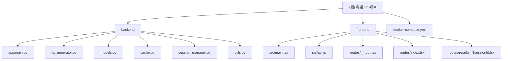

# 粤语语音合成（Cantonese TTS）项目

## 变更记录 (Changelog)

- **2025-10-22**: 初始化 AI 上下文文档，生成根级和模块级文档
- 项目为现代化粤语 TTS 应用，支持智能分词和交互式语音播放

## 项目愿景

本项目旨在构建一个现代化的粤语语音合成应用，通过结合 Microsoft Edge TTS 技术和中文智能分词算法，为粤语学习者提供高效的语音学习工具。用户可以输入中文文本，系统自动进行分词处理，并支持点击式单词级别的粤语语音播放。

## 架构总览

项目采用前后端分离的现代化架构：

### 技术栈
- **后端**: Python 3.11 + FastAPI + edge-tts + jieba 分词
- **前端**: React 18 + Vite 7 + TanStack Router + TailwindCSS
- **部署**: Docker + Docker Compose + Nginx 反向代理

### 核心特性
- 智能中文分词（基于 jieba）
- 粤语语音合成（Microsoft Edge TTS）
- 交互式单词级播放
- 会话管理系统
- 高性能缓存机制
- 持久化存储（Redis）
- 响应式现代化 UI

## 模块结构图



## 模块索引

| 模块 | 路径 | 类型 | 职责 | 关键文件 |
|------|------|------|------|----------|
| **backend** | `backend/` | Python FastAPI 服务 | TTS语音合成、文本分词、会话管理、缓存 | `main.py`, `tts_generator.py`, `models.py` |
| **frontend** | `frontend/` | React 应用 | 用户界面、路由管理、API集成 | `main.tsx`, `api.js`, `routes/` |

### 模块详细职责

#### Backend (backend/)
- **TTS生成**: 基于 edge-tts 的粤语语音合成
- **智能分词**: 使用 jieba 进行中文文本分析
- **会话管理**: 支持临时和持久化会话存储
- **缓存系统**: 文件级音频缓存，支持TTL管理
- **API接口**: RESTful API，支持流式音频响应

#### Frontend (frontend/)
- **路由管理**: 基于 TanStack Router 的文件路由系统
- **用户界面**: 现代化响应式设计，支持深色主题
- **API集成**: 与后端服务的异步通信
- **交互体验**: 点击式单词播放，流畅的动画效果
- **会话历史**: 支持持久化会话的访问和管理

## 运行与开发

### 快速启动
```bash
# Docker 一键部署（推荐）
docker-compose up -d

# 本地开发环境
# 后端
cd backend && uvicorn app.main:app --reload
# 前端
cd frontend && npm run dev
```

### 访问地址
- **前端应用**: http://localhost (Docker) / http://localhost:5173 (开发)
- **后端API**: http://localhost:8000
- **API文档**: http://localhost:8000/docs

### 主要端点
- `POST /api/v1/generate` - TTS语音生成
- `POST /api/v1/segment` - 中文文本分词
- `GET /api/v1/voices` - 获取可用语音列表
- `POST /api/v1/sessions` - 创建会话
- `GET /api/v1/sessions/{id}` - 获取会话数据

## 测试策略

### 当前测试覆盖
- **后端**: FastAPI 自动生成的 API 文档和测试界面
- **前端**: TanStack Router 开发工具
- **集成测试**: Docker 容器化部署验证

### 建议补充
- 后端单元测试（pytest）
- 前端组件测试（Jest + Testing Library）
- API 集成测试
- E2E 测试（Playwright）

## 编码规范

### 后端 (Python)
- 遵循 PEP 8 编码规范
- 使用 Pydantic 进行数据验证
- 异步编程（async/await）
- 类型注解（Type Hints）
- 结构化日志记录

### 前端 (JavaScript/TypeScript)
- ESLint 代码规范检查
- 函数式组件和 Hooks
- TypeScript 类型安全（部分应用）
- 模块化导入导出
- 响应式设计原则

## AI 使用指引

### 开发助手使用建议
1. **API开发**: 优先查看 `backend/app/main.py` 了解现有端点
2. **前端组件**: 参考 `frontend/src/routes/index.tsx` 的组件结构
3. **数据模型**: 检查 `backend/app/models.py` 的请求/响应格式
4. **样式系统**: 使用 TailwindCSS 类，遵循现有的设计系统

### 常见开发场景
- **添加新的API端点**: 在 `main.py` 中注册路由，更新 `models.py`
- **新增前端页面**: 在 `frontend/src/routes/` 创建新组件
- **修改TTS参数**: 检查 `tts_generator.py` 中的 edge-tts 配置
- **缓存策略调整**: 修改 `cache.py` 中的缓存逻辑

## 性能优化

### 已实现的优化
- **音频缓存**: 文件级缓存，支持TTL和LRU清理
- **会话管理**: Redis 持久化，减少重复分词计算
- **流式响应**: 音频数据流式传输，减少内存占用
- **前端构建**: Vite 快速构建和热重载

### 可进一步优化的方向
- 音频压缩和格式优化
- CDN 静态资源分发
- 数据库查询优化
- 前端代码分割和懒加载

## 部署说明

### 生产环境部署
- 使用 `docker-compose.yml` 进行容器化部署
- Nginx 反向代理和静态文件服务
- 支持环境变量配置
- 健康检查和自动重启策略

### 扩展部署
- Redis 集群支持
- 负载均衡配置
- 监控和日志收集
- 自动扩缩容策略

---

## 相关链接

- [FastAPI 官方文档](https://fastapi.tiangolo.com/)
- [React 开发文档](https://react.dev/)
- [TanStack Router 文档](https://tanstack.com/router/latest)
- [Edge TTS 项目](https://github.com/rany2/edge-tts)
- [Jieba 分词](https://github.com/fxsjy/jieba)