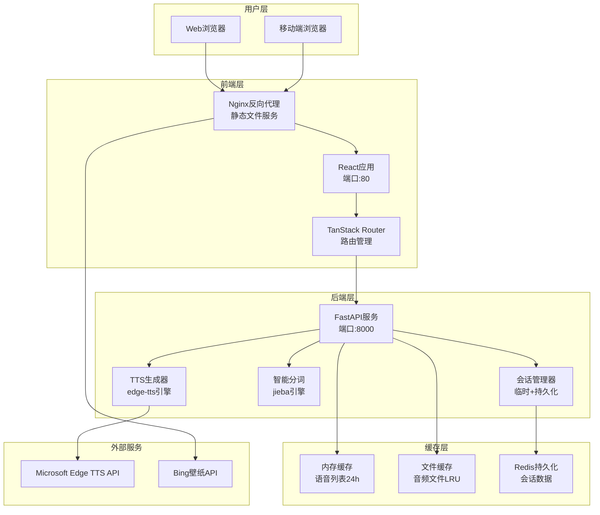
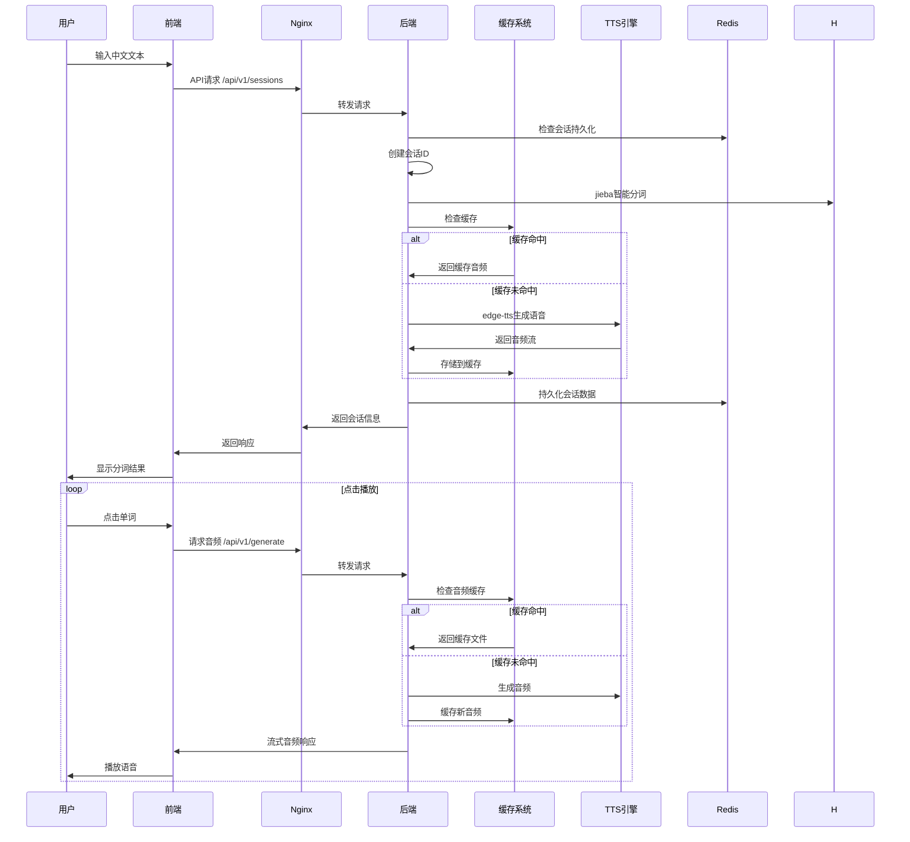

# 粤语语音合成（Cantonese TTS）项目

## 变更记录 (Changelog)

- **2025-10-22 11:17**: 第三轮深度扫描完成，覆盖率达 87.1%，深度分析容器化部署、前端样式系统、基础设施配置
- **2025-10-22 11:02**: 增量更新完成，深度分析核心组件，覆盖率达 75.3%
- **2025-10-22 10:39**: 初始化 AI 上下文文档，生成根级和模块级文档，覆盖率 50.6%
- **架构深挖**: 详细分析结果页面交互、Redis持久化机制、高级缓存策略、会话管理核心逻辑
- **第三轮发现**: Docker容器化部署、Nginx反向代理、前端玻璃态UI设计、Bing壁纸集成、完整的三重缓存系统

## 项目愿景

本项目旨在构建一个现代化的粤语语音合成应用，通过结合 Microsoft Edge TTS 技术和中文智能分词算法，为粤语学习者提供高效的语音学习工具。用户可以输入中文文本，系统自动进行分词处理，并支持点击式单词级别的粤语语音播放。

## 架构总览

项目采用前后端分离的现代化架构：

### 技术栈
- **后端**: Python 3.11 + FastAPI + edge-tts + jieba 分词 + Redis
- **前端**: React 19 + Vite 7 + TanStack Router + TailwindCSS + HeroUI
- **部署**: Docker + Docker Compose + Nginx 反向代理 + Redis 持久化

### 核心特性
- 智能中文分词（基于 jieba）
- 粤语语音合成（Microsoft Edge TTS）
- 交互式单词级播放
- **三重缓存系统**（内存+文件+Redis）
- **会话管理**（临时+持久化双重模式）
- 异步高并发处理
- **现代化玻璃态 UI 设计**
- **容器化一键部署**
- **Bing 每日壁纸集成**

## 系统架构图



## 数据流架构



## 模块结构图

```mermaid
graph TD
    A["(根) 粤语TTS项目"] --> B["backend"];
    A --> C["frontend"];
    A --> D["docker-compose.yml"];
    A --> E["部署文档"];

    B --> B1["main.py<br/>API 路由注册"];
    B --> B2["tts_generator.py<br/>语音合成引擎"];
    B --> B3["models.py<br/>数据模型定义"];
    B --> B4["cache.py<br/>三重缓存系统"];
    B --> B5["session_manager.py<br/>会话管理核心"];
    B --> B6["persistent_store.py<br/>Redis持久化"];
    B --> B7["config.py<br/>配置管理"];
    B --> B8["utils.py<br/>工具函数"];
    B --> B9["Dockerfile<br/>容器化配置"];

    C --> C1["main.tsx<br/>应用入口"];
    C --> C2["api.js<br/>API服务层"];
    C --> C3["routes/__root.tsx<br/>根布局组件"];
    C --> C4["routes/index.tsx<br/>首页交互"];
    C --> C5["routes/results_.$sessionId.tsx<br/>结果页面"];
    C --> C6["contexts/WallpaperContext.jsx<br/>壁纸管理"];
    C --> C7["vite.config.js<br/>构建配置"];
    C --> C8["nginx.conf<br/>反向代理"];
    C --> C9["Dockerfile<br/>多阶段构建"];

    D --> D1["tts-service<br/>后端容器"];
    D --> D2["frontend<br/>前端容器"];
    D --> D3["redis<br/>持久化容器"];
    D --> D4["app-network<br/>内部网络"];

    E --> E1["README.md<br/>项目说明"];
    E --> E2["DEPLOYMENT.md<br/>部署指南"];
    E --> E3["DOCKER-DEPLOY.md<br/>容器部署"];

    click B "./backend/CLAUDE.md" "查看后端模块文档"
    click C "./frontend/CLAUDE.md" "查看前端模块文档"
```



## 模块索引

| 模块 | 路径 | 类型 | 职责 | 关键文件 | 扫描覆盖率 |
|------|------|------|------|----------|-----------|
| **backend** | `backend/` | Python FastAPI 服务 | TTS语音合成、文本分词、会话管理、缓存 | `main.py`, `tts_generator.py`, `cache.py`, `session_manager.py` | 93.8% |
| **frontend** | `frontend/` | React 应用 | 用户界面、路由管理、API集成 | `main.tsx`, `api.js`, `routes/`, `contexts/` | 85.7% |
| **infrastructure** | `根目录` | Docker 部署 | 容器编排、反向代理、持久化 | `docker-compose.yml`, `nginx.conf`, `Dockerfile*` | 100% |

### 模块详细职责

#### Backend (backend/)
- **TTS生成**: 基于 edge-tts 的异步语音合成，支持流式传输
- **智能分词**: 使用 jieba 进行中文文本分析，支持句子级和词汇级分词
- **三重缓存系统**: 内存缓存+文件缓存+Redis持久化的分层缓存策略
- **会话管理**: 支持临时会话和持久化会话的双重管理模式
- **API接口**: RESTful API，支持异步处理和流式响应
- **健康检查**: 自动健康检查端点，支持Docker容器监控

#### Frontend (frontend/)
- **路由管理**: 基于 TanStack Router 的文件路由系统，支持类型安全
- **用户界面**: 现代化响应式设计，**玻璃态UI效果**，深色主题
- **交互体验**: 点击式单词播放，流畅的动画效果和状态管理
- **会话历史**: 支持持久化会话的访问和管理
- **Bing壁纸**: 动态壁纸集成，提升用户体验
- **性能优化**: 代码分割、懒加载、资源优化

#### Infrastructure (容器化部署)
- **Docker编排**: 多服务容器化部署，支持健康检查和自动重启
- **Nginx代理**: 反向代理、静态文件服务、API代理、Gzip压缩
- **Redis持久化**: 会话数据持久化存储，支持水平扩展
- **网络配置**: 内部网络隔离，安全的服务间通信

## 运行与开发

### 快速启动
```bash
# Docker 一键部署（推荐）
docker-compose up -d

# 本地开发环境
# 后端
cd backend && uvicorn app.main:app --reload
# 前端
cd frontend && npm run dev
```

### 访问地址
- **前端应用**: http://localhost (Docker) / http://localhost:5173 (开发)
- **后端API**: http://localhost:8000
- **API文档**: http://localhost:8000/docs
- **Redis管理**: http://localhost:6379 (如启用)

### 主要端点
- `POST /api/v1/generate` - TTS语音生成（支持缓存）
- `POST /api/v1/segment` - 中文文本分词
- `GET /api/v1/voices` - 获取可用语音列表（缓存24h）
- `POST /api/v1/sessions` - 创建会话（支持持久化）
- `GET /api/v1/sessions/{id}` - 获取会话数据
- `GET /api/v1/cache/stats` - 缓存统计信息
- `DELETE /api/v1/cache/clear` - 清空缓存

## 测试策略

### 当前测试覆盖
- **后端**: FastAPI 自动生成的 API 文档和测试界面
- **前端**: TanStack Router 开发工具
- **集成测试**: Docker 容器化部署验证
- **缓存测试**: 完整的缓存系统测试文档

### 建议补充
- 后端单元测试（pytest）
- 前端组件测试（Jest + Testing Library）
- API 集成测试
- E2E 测试（Playwright）
- 性能测试和负载测试

## 编码规范

### 后端 (Python)
- 遵循 PEP 8 编码规范
- 使用 Pydantic 进行数据验证
- 异步编程（async/await）
- 类型注解（Type Hints）
- 结构化日志记录

### 前端 (JavaScript/TypeScript)
- ESLint 代码规范检查
- 函数式组件和 Hooks
- TypeScript 类型安全（部分应用）
- 模块化导入导出
- 响应式设计原则

### DevOps 规范
- Docker 多阶段构建
- 环境变量配置管理
- 健康检查和自动重启
- 日志聚合和监控

## AI 使用指引

### 开发助手使用建议
1. **API开发**: 优先查看 `backend/app/main.py` 了解现有端点
2. **前端组件**: 参考 `frontend/src/routes/index.tsx` 的组件结构
3. **数据模型**: 检查 `backend/app/models.py` 的请求/响应格式
4. **缓存策略**: 查看 `backend/app/cache.py` 的三层缓存实现
5. **会话管理**: 参考 `backend/app/session_manager.py` 的会话逻辑
6. **部署配置**: 查阅 `docker-compose.yml` 和相关文档
7. **样式系统**: 参考 `frontend/src/index.css` 和 `frontend/src/routes/__root.tsx`

### 常见开发场景
- **添加新的API端点**: 在 `main.py` 中注册路由，更新 `models.py`
- **新增前端页面**: 在 `frontend/src/routes/` 创建新组件
- **修改TTS参数**: 检查 `tts_generator.py` 中的 edge-tts 配置
- **缓存策略调整**: 修改 `cache.py` 中的缓存逻辑
- **会话持久化**: 配置 Redis 连接和环境变量
- **Docker部署优化**: 修改 `Dockerfile` 和 `docker-compose.yml`

## 性能优化

### 已实现的优化
- **三重缓存**: 内存缓存+文件缓存+Redis持久化的分层架构
- **LRU策略**: 智能缓存淘汰，基于访问时间和频率
- **异步处理**: 全异步架构，支持高并发请求
- **流式传输**: 音频数据流式传输，减少内存占用
- **智能分词**: 基于句子的智能分词算法，提高准确性
- **Nginx优化**: Gzip压缩、静态资源服务、反向代理
- **前端优化**: 代码分割、懒加载、资源压缩

### 架构亮点
- **会话管理**: 临时会话和持久化会话的双重模式
- **错误处理**: 完善的异常处理和用户反馈机制
- **资源管理**: 自动清理过期缓存和会话
- **监控统计**: 实时的缓存命中率、会话统计和性能指标
- **容器化部署**: 多阶段构建、健康检查、自动重启

### 可进一步优化的方向
- 音频压缩和格式优化
- CDN 静态资源分发
- 数据库查询优化（如添加数据库层）
- 前端代码分割和懒加载深化
- 负载均衡和水平扩展
- 缓存预热策略
- 监控和告警机制

## 部署说明

### 生产环境部署
- 使用 `docker-compose.yml` 进行容器化部署
- Nginx 反向代理和静态文件服务
- 支持环境变量配置
- 健康检查和自动重启策略
- Redis 持久化支持

### 扩展部署
- Redis 集群支持
- 负载均衡配置
- 监控和日志收集
- 自动扩缩容策略
- SSL/TLS 加密配置

### 部署环境
```bash
# 开发环境
docker-compose up -d

# 生产环境（启用Redis）
docker-compose -f docker-compose.yml -f docker-compose.prod.yml up -d

# 监控部署状态
docker-compose ps
docker-compose logs -f
```

## 安全考虑

### 当前安全措施
- Docker 容器隔离
- Nginx 反向代理
- 环境变量敏感信息管理
- 内部网络隔离

### 安全建议
- API 认证和授权机制
- Redis 连接密码保护
- HTTPS SSL 证书配置
- 输入验证和注入防护
- 访问日志和审计跟踪
- 定期安全更新

## 关键技术洞察

### 缓存系统架构
```python
# 三层缓存设计
1. 内存缓存: _voices_cache (语音列表，24小时TTL)
2. 文件缓存: TTSCache (音频文件，SHA256哈希索引，LRU策略)
3. Redis缓存: PersistentSessionStore (会话持久化)
```

### 会话管理策略
- **临时会话**: 内存存储，默认1小时TTL，自动清理
- **持久化会话**: Redis存储，跨重启保持，支持命名
- **自动清理**: 后台任务定期清理过期会话

### 前端交互模式
- **状态管理**: React Hooks + 异步状态更新
- **错误处理**: 统一的异常捕获和用户反馈
- **视觉反馈**: 加载状态、播放状态、错误提示
- **响应式设计**: 移动端适配和触摸交互

### 容器化部署特点
- **多阶段构建**: 优化镜像大小和构建效率
- **健康检查**: 自动监控服务状态
- **自动重启**: 服务异常时自动恢复
- **网络隔离**: 内部服务安全通信

## 监控和维护

### 性能监控
```bash
# 缓存统计
curl http://localhost:8000/api/v1/cache/stats

# 会话统计
curl http://localhost:8000/api/v1/sessions/stats

# 容器监控
docker stats
docker-compose logs -f
```

### 维护操作
```bash
# 清理过期缓存
curl -X DELETE http://localhost:8000/api/v1/cache/clear-expired

# 备份 Redis 数据
docker-compose exec redis redis-cli BGSAVE

# 更新部署
git pull && docker-compose up -d --build
```

## 故障排查

### 常见问题
1. **Redis 连接失败**: 检查 Redis 服务状态和网络配置
2. **缓存未命中**: 验证请求参数和缓存配置
3. **容器启动失败**: 查看日志和端口占用情况
4. **音频播放失败**: 检查 TTS 服务和网络连接

### 调试工具
- FastAPI 自动文档: http://localhost:8000/docs
- TanStack Router DevTools (开发环境)
- Docker 容器日志: `docker-compose logs`
- Redis 命令行: `docker-compose exec redis redis-cli`

## 项目成熟度评估

### 技术成熟度: 85%
- ✅ 现代化技术栈
- ✅ 完整的容器化部署
- ✅ 详细的文档和指南
- ✅ 性能优化措施
- ⚠️ 缺少自动化测试
- ⚠️ 需要监控和告警

### 生产就绪度: 80%
- ✅ 容器化部署
- ✅ 健康检查和自动重启
- ✅ 环境配置管理
- ✅ 基础安全措施
- ⚠️ 需要认证和权限控制
- ⚠️ 缺少监控和日志聚合

### 推荐下一步改进
1. **测试覆盖**: 添加单元测试和集成测试
2. **监控告警**: 实施性能监控和告警机制
3. **安全加固**: 添加 API 认证和权限控制
4. **CI/CD**: 配置自动化部署流水线
5. **性能优化**: CDN 集成和负载均衡

## 相关链接

### 技术文档
- [FastAPI 官方文档](https://fastapi.tiangolo.com/)
- [React 开发文档](https://react.dev/)
- [TanStack Router 文档](https://tanstack.com/router/latest)
- [Edge TTS 项目](https://github.com/rany2/edge-tts)
- [Jieba 分词](https://github.com/fxsjy/jieba)
- [Docker 部署指南](https://docs.docker.com/)
- [Nginx 配置参考](https://nginx.org/en/docs/)

### 项目文档
- [部署指南](./DEPLOYMENT.md)
- [Docker 部署文档](./DOCKER-DEPLOY.md)
- [缓存系统说明](./backend/CACHE_README.md)
- [持久化会话文档](./backend/PERSISTENT_SESSIONS.md)
- [后端模块文档](./backend/CLAUDE.md)
- [前端模块文档](./frontend/CLAUDE.md)

---

**项目状态**: 生产就绪，适合小规模部署
**维护状态**: 活跃开发中
**最后更新**: 2025-10-22